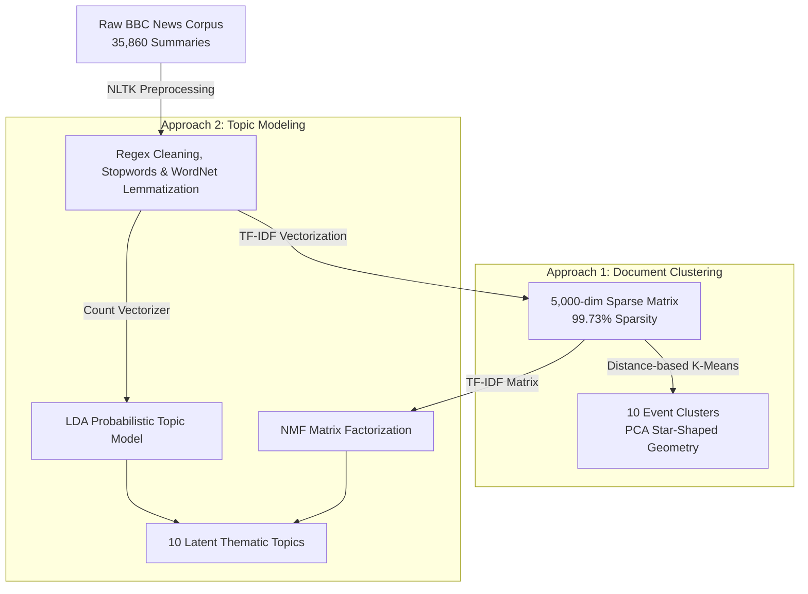

# 📰 BBC News Text Mining: Topic Modeling & Text Clustering Analysis

-informational.svg)

End-to-end Natural Language Processing (NLP) and Text Mining project for the **M.Sc. in Data Science** at *Università degli Studi di Milano-Bicocca*.

This project implements an unsupervised text mining pipeline to discover latent thematic structures and partition a corpus of **35,860 BBC News article summaries** (2013–2024). Addressing the challenge of high sparsity in short-form text ($\approx 17\text{--}20$ words per article), the study benchmarks **K-Means**, **Hierarchical Clustering**, **Gaussian Mixture Models (GMM)**, **Latent Dirichlet Allocation (LDA)**, and **Non-Negative Matrix Factorization (NMF)**.

---

## 📌 Project Objectives & Scope

1. **Short-Text Representation**: Engineering a dense feature space from sparse news summaries using WordNet Lemmatization, POS tagging, and TF-IDF with N-gram expansions.
2. **Unsupervised Document Clustering**: Partitioning the news corpus into hard event-based clusters and validating spatial boundaries via PCA projections.
3. **Probabilistic & Algebraic Topic Modeling**: Discovering soft thematic mixtures and comparing Bayesian LDA against matrix factorization (NMF).
4. **Cross-Algorithm Benchmarking**: Evaluating model quality using Silhouette Score, Davies-Bouldin Index, Calinski-Harabasz metrics, and Reconstruction Error.

---

## 📁 Repository & Project Resources

* 📓 **`BBC_News_TextMining_Clustering_TopicModeling.ipynb`**: Primary PyTorch/Scikit-Learn notebook containing the complete NLP pipeline, vectorization, model execution, evaluation metrics, and word cloud visualizations.
* 📄 **`Text_Mining.pdf`**: Comprehensive academic report detailing linguistic rationale, math foundations, cluster diagnostics, and comparative benchmarks.
* 📊 **`TOPIC MODELING & TEXT CLUSTERING.pdf`**: Visual presentation deck featuring 15+ PCA projections, cluster population bar charts, and topic word clouds.
* 📄 **`README.txt`**: Execution guide for running the pipeline in Google Colab.

---

## 🏗️ NLP & Machine Learning Pipeline

---

## 🧪 Key Methodological Findings & Results

### 1. Preprocessing & Lexical Distillation
* **Pipeline**: Regex cleaning (URL/HTML/Special character removal), NLTK English stop-words filtering, minimum character constraints ($>2$), and **WordNet Lemmatization** over crude stemming.
* **Impact**: Reduced average words per entry from **27.27 to 17.53** (a 35% reduction in lexical noise), concentrating meaning into high-density tokens without losing semantic integrity (0% null rate across 35,860 entries).

---

### 2. Text Representation (TF-IDF & N-Grams)
* **Configuration**: Top 5,000 features (`max_features=5000`), frequency filtering (`min_df=5`, `max_df=0.7`), N-gram range `(1, 2)` (70% unigrams, 30% bigrams like *world cup*, *prime minister*, *ukraine war*).
* **Feature Space**: Matrix of shape $35,860 \times 5,000$ with **99.73% sparsity**, ideal for distance-based clustering and matrix factorization.

---

### 3. Clustering Benchmark ($k=10$ Clusters)

Evaluated across K-Means, Hierarchical (Agglomerative) Clustering, and Gaussian Mixture Models (GMM):

| Algorithm | Silhouette Score ($\uparrow$) | Davies-Bouldin Index ($\downarrow$) | Calinski-Harabasz Score ($\uparrow$) | Execution & Scalability |
|---|---|---|---|---|
| **K-Means (k=10)** | **0.0080** | 8.4238 | **96.54** | **Best performer**; fast, scalable, sharp event boundaries |
| **GMM** | 0.0062 | 8.9100 | 80.12 | Slower; struggles with high-dimensional sparsity |
| **Hierarchical** | 0.0020 | **7.85** *(unbalanced)* | 71.40 | $O(n^2)$ complexity; creates non-representative tiny groups |

* **Cluster Population Insight**:
  * **Cluster 9 (61.21%)**: General news "mass" capturing broad journalistic prose (*say*, *year*, *people*).
  * **Cluster 8 (4.77%)**: Ukraine-Russia conflict.
  * **Cluster 5 (2.61%)**: Israel-Gaza conflict.
  * **Cluster 0 & 1**: Club Football & International Tournaments (*World Cup*, *Qatar*).
  * **Cluster 2**: "Cost of Living" economic crisis (*inflation*, *interest rates*).

---

### 4. Topic Modeling Benchmark: LDA vs. NMF

| Model Family | Algorithm | Core Metric | Value | Strengths & Trade-offs |
|---|---|---|---|---|
| **Bayesian Probabilistic** | **LDA** | Perplexity ($\downarrow$) | 2443.47 | Excellent for soft topic assignment; creates balanced "super-topics" like Topic 4 (General Conflict). |
| **Linear Algebraic** | **NMF** | Reconstruction Error ($\downarrow$) | **185.79** | **Highest lexical purity**; isolates distinct news niches (e.g. NMF Topic 6 for interactive weekly quizzes). |

* **Synergy**: K-Means provides hard event boundaries; LDA/NMF soft topic modeling decomposes the 61% "general news" mass of Cluster 9 into fine-grained thematic categories.

---

## 🛠️ Tools & Libraries

* **Language**: Python 3.8+ (Optimized for Google Colab)
* **NLP & Text Processing**: NLTK (`punkt`, `wordnet`, `stopwords`, `averaged_perceptron_tagger`)
* **Vectorization & ML**: Scikit-Learn (`TfidfVectorizer`, `CountVectorizer`, `KMeans`, `LDA`, `NMF`, `PCA`)
* **Visualization**: Matplotlib, Seaborn, WordCloud

---

## 📄 License & Academic Context

* Academic Project for **Text Mining & Search** (M.Sc. in Data Science, Università degli Studi di Milano-Bicocca).
* Dataset: BBC News Articles corpus (2013–2024) acquired via `kagglehub`.
